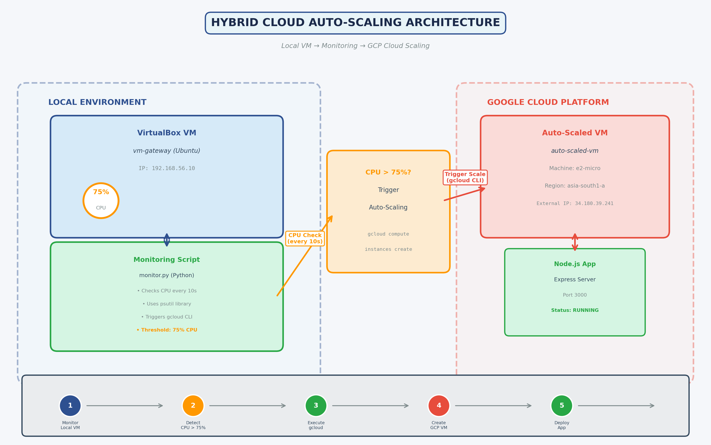

# Hybrid Cloud Auto-Scaling: Local VM to GCP

**Automatic cloud bursting when local VM resources exceed threshold**



## 📋 Overview

This project implements a hybrid cloud auto-scaling system that monitors a local VirtualBox VM and automatically provisions resources on Google Cloud Platform when CPU usage exceeds 75%. It demonstrates cloud bursting capabilities, allowing cost-effective local infrastructure with on-demand cloud scaling.

---

## 🏗️ Architecture

**Components:**
- **Local VM**: VirtualBox VM running Ubuntu Server (vm-gateway)
- **Monitoring Script**: Python script using `psutil` and `gcloud CLI`
- **Cloud Platform**: Google Cloud Platform Compute Engine
- **Application**: Node.js Express API deployed on auto-scaled instances

**Workflow:**
1. Monitor script checks VM CPU every 10 seconds
2. When CPU > 75%, trigger `gcloud` to create a GCP instance
3. Deploy Node.js app automatically on the new cloud VM
4. App accessible via external IP on port 3000

---

## 🚀 Quick Start

### Prerequisites

- **VirtualBox** with at least one VM running
- **Python 3.x** installed
- **Google Cloud Platform** account with billing enabled
- **gcloud CLI** installed and configured

### Installation

**1. Install Python Dependencies**
```bash
pip install psutil google-cloud-compute google-auth
```

**2. Install and Configure gcloud CLI**
```bash
# Download from: https://cloud.google.com/sdk/docs/install
gcloud init
gcloud config set project YOUR_PROJECT_ID
```

**3. Enable GCP APIs**
```bash
gcloud services enable compute.googleapis.com
```

**4. Create Firewall Rule**
```bash
gcloud compute firewall-rules create allow-node-app \
  --allow tcp:3000 \
  --source-ranges 0.0.0.0/0 \
  --target-tags http-server
```

---

## 📝 Usage

### Run the Monitoring Script

```bash
cd gcp-monitoring
python monitor.py
```

The script will:
- Monitor the VirtualBox VM CPU every 10 seconds
- Display current CPU percentage
- Automatically create a GCP VM when CPU > 75%
- Log scaling events to `scale_log.txt`

### Trigger Auto-Scaling (Testing)

In your VirtualBox VM, run a CPU stress test:

```bash
# Install stress-ng
sudo apt install stress-ng -y

# Stress test (pushes CPU to 90%+)
stress-ng --cpu 4 --vm 2 --vm-bytes 512M --timeout 180s
```

Watch the monitoring script detect high CPU and create the cloud VM!

### Verify Cloud VM

```bash
# List all instances
gcloud compute instances list

# SSH into the auto-scaled VM
gcloud compute ssh auto-scaled-vm --zone=asia-south1-a

# Test the deployed app
curl http://EXTERNAL_IP:3000
```

---

## 📁 Project Structure

```
gcp-monitoring/
├── monitor.py              # Main monitoring script
├── stress_vm.py            # VM stress test script
├── scale_log.txt           # Scaling event log (generated)
├── architecture_diagram_autoscale.png  # Architecture diagram
└── README.md               # This file
```

---

## 🔧 Configuration

Edit `monitor.py` to customize:

```python
THRESHOLD = 75                      # CPU threshold percentage
VM_NAME = "vm-gateway"              # VirtualBox VM name
GCP_PROJECT_ID = "your-project-id"  # Your GCP project
GCP_ZONE = "asia-south1-a"          # GCP zone
GCP_INSTANCE_NAME = "auto-scaled-vm"  # Name for cloud VMs
CHECK_INTERVAL = 10                 # Check frequency (seconds)
```

---

## 📊 Monitoring Output

```
🔍 Monitoring VirtualBox VM: vm-gateway
📊 CPU Threshold: 75%
------------------------------------------------------------
[19:39:24] Check #1 - VM CPU: 0.0% ✓
[19:39:34] Check #2 - VM CPU: 0.2% ✓
[19:39:44] Check #3 - VM CPU: 8.8% ✓
[19:39:54] Check #4 - VM CPU: 24.7% ⚠️ THRESHOLD EXCEEDED!

🚀 THRESHOLD EXCEEDED! Creating GCP VM...
✅ GCP VM created successfully!
```

---

## 🌐 Deployed Application

Once the GCP VM is created, a Node.js application is automatically deployed:

**Access the app:**
```
http://EXTERNAL_IP:3000
```

**Response:**
```json
{
  "message": "Auto-scaled to GCP Cloud!",
  "vm": "auto-scaled-vm",
  "timestamp": "2026-03-29T17:06:57.414Z",
  "status": "running"
}
```

---

## 🛠️ Troubleshooting

| Issue | Solution |
|-------|----------|
| `gcloud: command not found` | Install gcloud CLI and add to PATH |
| `VBoxManage: command not found` | Add VirtualBox installation path to PATH |
| `ConnectionError` when creating VM | Check internet connection, verify GCP credentials |
| CPU never exceeds threshold | Lower `THRESHOLD` value for testing (e.g., 20%) |
| Firewall blocks port 3000 | Verify firewall rule with `gcloud compute firewall-rules list` |

---

## 📚 Technical Details

**VBoxManage Metrics:**
- Uses `VBoxManage metrics query` to read VM CPU usage
- Parses CPU/Load/User metric for accurate CPU percentage

**gcloud CLI Integration:**
- Creates e2-micro instances (free tier eligible)
- Uses ubuntu-2204-lts image
- Automatically assigns external IP
- Tags instance with `http-server` for firewall rules

**Auto-Deployment:**
- Startup script installs Node.js and dependencies
- Deploys Express app listening on port 3000
- Application starts automatically on VM boot

---

## 📄 License

Educational project - MIT License

---

## 👤 Author

**Your Name**  
Assignment: Virtualization and Cloud Computing  
Date: March 2026

---

## 🔗 References

- [VirtualBox Documentation](https://www.virtualbox.org/manual/)
- [Google Cloud Compute Engine](https://cloud.google.com/compute/docs)
- [gcloud CLI Reference](https://cloud.google.com/sdk/gcloud/reference)
- [psutil Documentation](https://psutil.readthedocs.io/)

---

**⭐ Star this repo if you found it helpful!**
